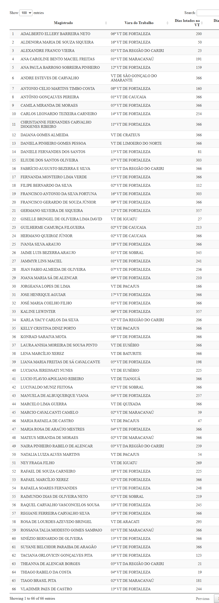

# Lotações Preponderantes
Ênio Lopes

Primeiramente deve-se gerar relatório de designações do período de
interesse no Sistema de Gratificação de Magistrados (SGM).

``` r
'A pasta utilizada na rede foi a seguinte: X:\SGE\GABINETE\LICENÇA COMPENSATÓRIA\2025'
```

Em Jan/2025 a funcionalidade de exportar as designações para *.xls* não
estava funcionando no SGM. Assim, tive que transformar o arquivo *.pdf*
para *.csv* a fim de realizar o cálculo das lotações preponderantes dos
magistrados.

Para transformar o arquivo *.pdf* para *.csv* foi utilizado o seguinte
código em python:

``` python
import tabula
import pandas as pd

file_path="RelatorioDesignacoes_2024.pdf"
csv_path="RelatorioDesignacoes_2024.csv"

tables=tabula.read_pdf(file_path,pages='all',multiple_tables=False)
designacoes=pd.concat(tables)
designacoes.to_csv(csv_path)
```

Após isso, foi utilizado o script R abaixo com o objetivo de calcular o
número de dias que cada juiz esteve lotado nas VTs. E, posteriormente,
identificar qual a VT que o juiz passou mais dias lotados durante o ano
de 2024:

``` r
#Pacotes necessários
library(dplyr)
library(lubridate)
library(stringr)
library(janitor)

designacoes<-read.csv("RelatorioDesignacoes_2024.csv",h=T,encoding = "UTF-8")
designacoes <- designacoes %>% 
  select(-X)
designacoes <- designacoes %>% 
  clean_names()
designacoes$de <- dmy(designacoes$de)
designacoes$ate <- dmy(designacoes$ate)

designacoes$unidade <- str_replace(designacoes$unidade,"a","ª")

unidades<-read.csv2("Unidades.csv",h=T)

designacoes<-designacoes%>%
  mutate(FIM=ifelse(ate>ymd("2024-12-31"),ymd("2024-12-31"),ate))%>%
  mutate(INICIO=ifelse(de<ymd("2024-01-01"),ymd("2024-01-01"),de))
designacoes$FIM<-as.Date(designacoes$FIM,origin = "1970-01-01")
designacoes$INICIO<-as.Date(designacoes$INICIO,origin = "1970-01-01")
designacoes$DIAS<-designacoes$FIM-designacoes$INICIO+1

desig_juiz<-designacoes%>%
  group_by(magistrado,unidade)%>%
  summarise(max_total_dias_vt=as.numeric(sum(DIAS)))

juizes<-unique(desig_juiz$magistrado)
resumo<-data.frame(magistrado=character(0),unidade=character(0),max_total_dias_vt=numeric(0))

for (i in juizes){
  filtro<-desig_juiz%>%
    filter(magistrado==i)
  agg<-filtro%>%
    group_by(magistrado)%>%
    summarise(tot_dias=sum(max_total_dias_vt))
  filtro<-filtro%>%
    filter(max_total_dias_vt==max(max_total_dias_vt))
  filtro<-left_join(filtro,agg,by="magistrado")
  resumo<-rbind(resumo,filtro)
}

resumo<-left_join(resumo,unidades,by=c("unidade"="UNIDADE"))%>%
  filter(TIPO=="VT")
```

O resultado pode ser observado por meio da seguinte tabela:



\* *Dias lotados - Total* : Nessa coluna é apresentado o número de dias
totais em que o magistrado esteve lotado em algumas das VTs do TRT-7.
